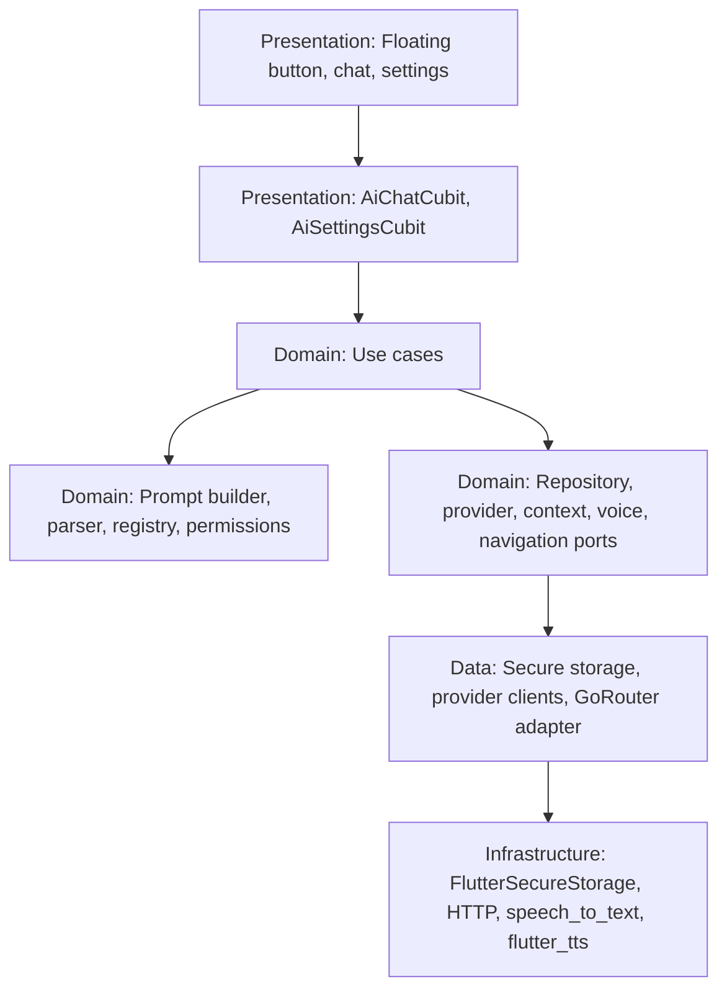
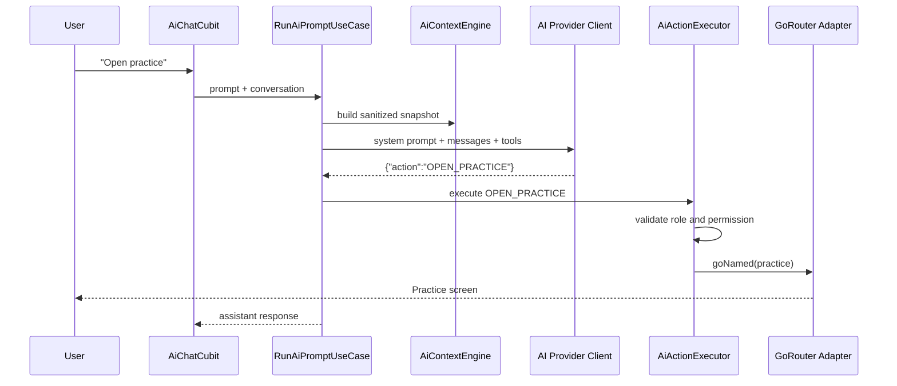

# Formula Scholar AI Assistant Architecture

## Scope

The AI Assistant is implemented as a controlled application copilot. The model
does not manipulate widgets or call internal APIs directly. It can only propose
registered action IDs, then the app validates permissions and executes the
matching command handler.

## Folder Structure

```text
lib/
  core/
    security/
      secret_redactor.dart
  features/
    ai/
      ai.dart
      domain/
        entities/
        ports/
        services/
        usecases/
      data/
        datasources/
        providers/
        repositories/
      presentation/
        cubit/
        pages/
        widgets/
```

## Layer Diagram



## Control Data Flow

```mermaid
flowchart LR
  Prompt["User prompt"]
  Sanitize["Input sanitizer"]
  Context["Sanitized context engine"]
  Model["Selected AI provider"]
  Parse["JSON/tool parser"]
  Permission["Permission validator"]
  Action["Action executor"]
  UIUpdate["GoRouter/UI state update"]

  Prompt --> Sanitize
  Sanitize --> Context
  Context --> Model
  Model --> Parse
  Parse --> Permission
  Permission --> Action
  Action --> UIUpdate
```



## Sequence



## Registered MVP Actions

```text
OPEN_DASHBOARD
OPEN_SUBJECTS
OPEN_PRACTICE
OPEN_SAVED
OPEN_PROFILE
OPEN_ANALYTICS
OPEN_STUDY_PLANNER
OPEN_FLASHCARDS
OPEN_CHEAT_SHEET
OPEN_HELP_SUPPORT
OPEN_AI_SETTINGS
GO_BACK
```

## Provider Strategy

`AiProviderClientPort` isolates provider-specific request formats. OpenAI,
Claude, and Gemini are implemented through HTTP clients and selected at runtime
by `AiProviderFactory`. Future providers such as Grok, DeepSeek, Mistral,
Ollama, OpenRouter, and Azure OpenAI can be added by implementing the same port
and registering the client in `registerRuntimeDependencies`.

## Security Controls

- API keys are stored with `FlutterSecureStorage`.
- Android secure storage uses `flutter_secure_storage`'s encrypted backend;
  current plugin versions migrate away from the deprecated Jetpack
  `EncryptedSharedPreferences` flag automatically.
- iOS uses Keychain accessibility after first unlock.
- API keys and bearer tokens are redacted before logging.
- The context engine excludes email, names, tokens, and raw profile data.
- Every AI action is registered, permission checked, and executed by the app.
- Offline/local intent fallback handles navigation when the provider is missing
  or unavailable.

## MVP Phases

Phase 1 is implemented: AI settings, provider selection, API key management,
chat UI, floating button, action framework, navigation actions, secure storage,
and offline fallback.

Phase 2 extension points are present: tool JSON parsing, context engine,
workflow-safe action executor, speech-to-text, and text-to-speech.

Phase 3 can add domain workflows by registering new actions that call existing
feature use cases instead of adding business logic to widgets.
